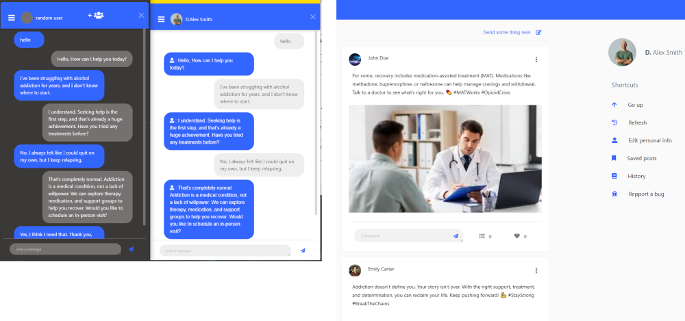
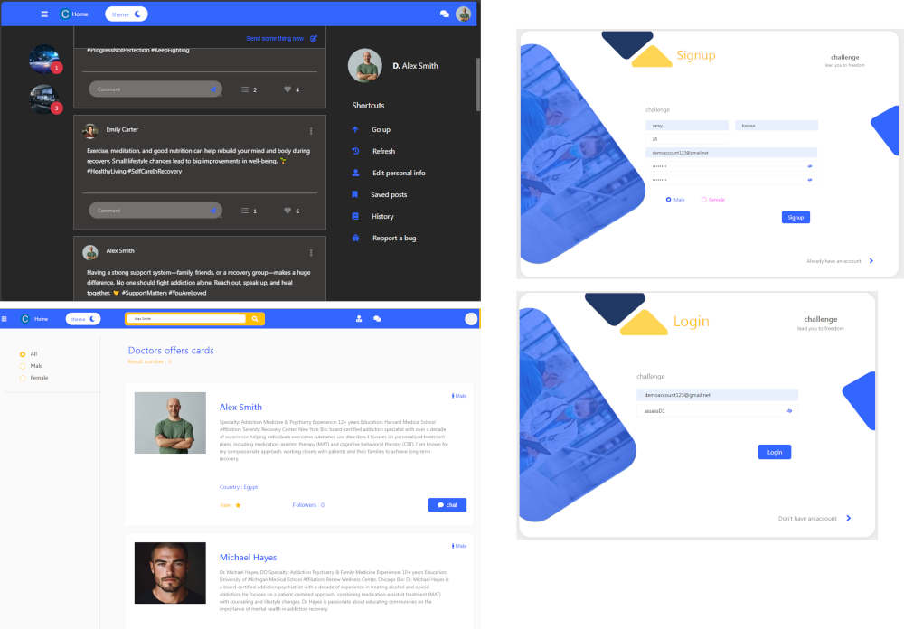
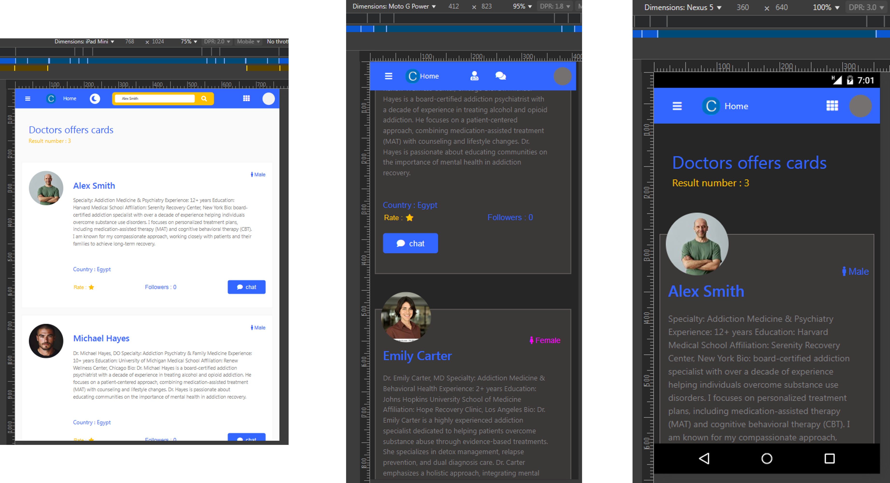
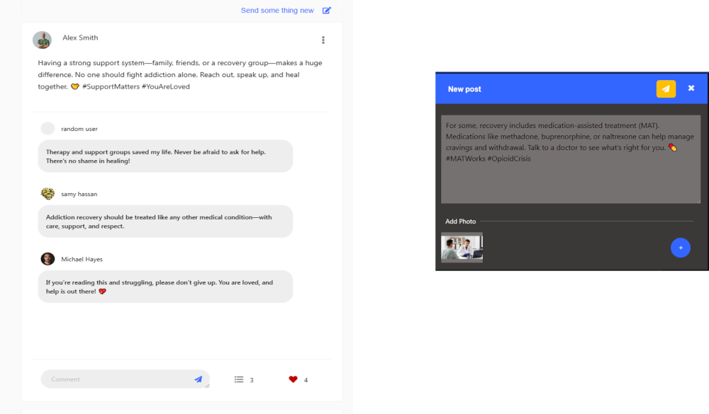
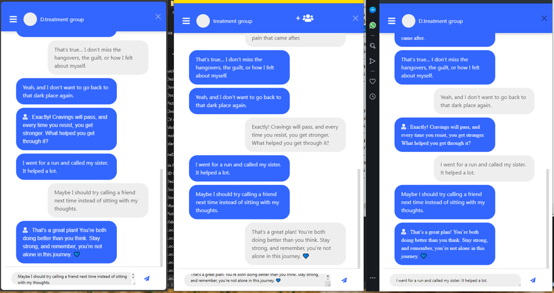

<h1 align="left">Hey 👋 What's up?</h1>

###

<h3 align="left">Project details</h3>

###

<h4 align="left">Name : Challenge</h4>

###

<b>Description : </b>a website for Addiction treatment and medical consultations in Addiction.

###

<b align="left">ex : </b><small>click to open</small>

###

<h3 align="left">Link</h3>

###

<a href="link">link</a>

###

###

<h3 align="left">Registered accounts (for try)</h3>

###

<h6 align="left">▶ you can register your own account</h6>

###

<b>#Users : </b><small>click to open</small>

<b>Email : </b>johndoe123@gmail.com 
<b>Password : </b>assassD1  
<b>Email : </b>randomuser456@outlook.com 
<b>Password : </b>123456Random  
<b>Email : </b>demoaccount123@gmail.net 
<b>Password : </b>assassD1  

 

<b>#Doctors : </b><small>click to open</small>

<b>Email : </b>alexsmith999@outlook.com 
<b>Password : </b>assassD1  
<b>Email : </b>fakeuseralpha@xmail.net 
<b>Password : </b>Emily 1234  
<b>Email : </b>randommail789@yahoo.com 
<b>Password : </b>assassD1

 

###

###

<h3 align="left">Coded with</h3>

###

  
  
  
  
  
  
  
  
  

###

<h3 align="left">Host</h3>

###

  

###

<h3 align="left">Contact</h3>

###

  
  
  

###